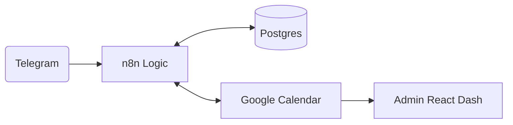

## 🎯 OBJETIVO
AutoAgenda es un sistema de gestión de citas para profesionales (médicos, entrenadores) que automatiza el flujo completo: validación de identidad, reserva de slots, sincronización con calendarios externos y recordatorios. Utiliza una arquitectura "Paranoid" para asegurar que cada interacción pase por un firewall de seguridad antes de tocar la lógica de negocio.

## 🔄 FLUJO PRINCIPAL


## 🗄️ DB: Esquema Clave
```json
{
  "users": ["id (uuid)", "telegram_id (bigint)", "role (user|admin)", "rut"],
  "providers": ["id", "slug", "google_calendar_id", "slot_duration_minutes"],
  "services": ["id", "provider_id", "price", "tier (standard|premium)"],
  "bookings": ["id", "user_id", "provider_id", "status", "start_time", "gcal_event_id"],
  "schedules": ["id", "provider_id", "day_of_week", "start_time", "end_time"],
  "security_firewall": ["entity_id (telegram:ID)", "strike_count", "is_blocked", "blocked_until"]
}
```

## ⚙️ CATÁLOGO DE WORKFLOWS
- **BB_00_Global_Handler**: Centraliza logs de error, redacta PII sensible y dispara alertas críticas a Telegram y base de datos.
- **BB_01_Telegram_Gateway**: Punto de entrada único que recibe y normaliza interacciones del bot para su enrutamiento interno.
- **BB_02_Security_Firewall**: Valida identidad y permisos en tiempo real; gestiona bloqueos por comportamiento sospechoso y baneos.
- **BB_03_Availability_Engine**: Calcula slots de tiempo disponibles cruzando calendarios laborales con citas ya confirmadas.
- **BB_04_Booking_Transaction**: Motor transaccional (Saga Pattern) que garantiza la reserva síncrona en Postgres y Google Calendar.
- **BB_05_Notification_Engine**: Generador de recordatorios automáticos (24h/2h) procesados por lotes para mejorar la asistencia.
- **BB_06_Admin_Dashboard**: Backend API y servidor SPA que expone la gestión de proveedores, configuración y auditoría.
- **BB_07_Retry_Worker**: Reintenta automáticamente el envío de notificaciones fallidas mediante una estrategia de backoff exponencial.
- **BB_08_JWT_Auth_Helper**: Servicio de seguridad para la generación y validación de tokens de acceso administrativo mediante Node.js.
- **BB_09_Deep_Link_Redirect**: Bridge que redirige tráfico web (`/agendar/:slug`) hacia flujos específicos dentro del bot de Telegram.

## 🖥️ UI: Estados y Rutas
Interfaz administrativa tipo SPA que gestiona la configuración global y la visualización de la agenda. Se alimenta de los endpoints expuestos por n8n (`BB_06_Admin_Dashboard`).
- **Rutas**: `/admin-v3/*` para gestión de proveedores y `/agendar-v3/:slug` para redirección a Telegram.
- **Componentes**: Panel de `app_config`, visor de logs de error (`system_errors`) y gestión de disponibilidad de profesionales.

## 📡 INTEGRACIONES
- **Telegram Bot**: Interfaz principal del usuario. Utiliza deep-linking para pre-seleccionar profesionales.
- **Google Calendar**: Fuente de verdad secundaria. `BB_04` implementa el Saga Pattern para asegurar consistencia atómica entre Postgres y GCal.


